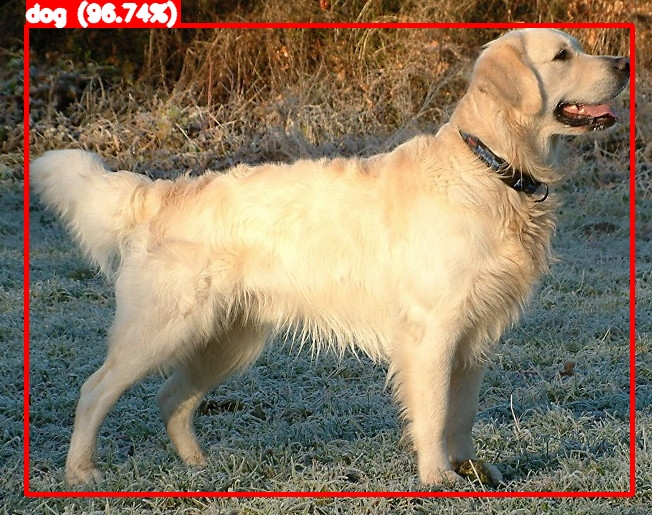

# object-detection-in-photo
# 🧠 Object Detection in Photos using YOLOv8

This is a lightweight and interactive web app that allows you to detect objects in uploaded images using [YOLOv8](https://github.com/ultralytics/ultralytics). The app draws bounding boxes around detected objects, showing their labels and confidence scores — all through a simple Streamlit interface.

---

## 🚀 Features

- Upload and analyze any image
- YOLOv8-powered object detection
- Bounding boxes with class names and confidence
- Fast, lightweight, and runs locally
- Easy to use via Streamlit

---

## 📸 Example

**Original Image:**

**Detection Output:**

> 📝 YOLOv8 correctly detected multiple objects like people, vehicles, and bags.

